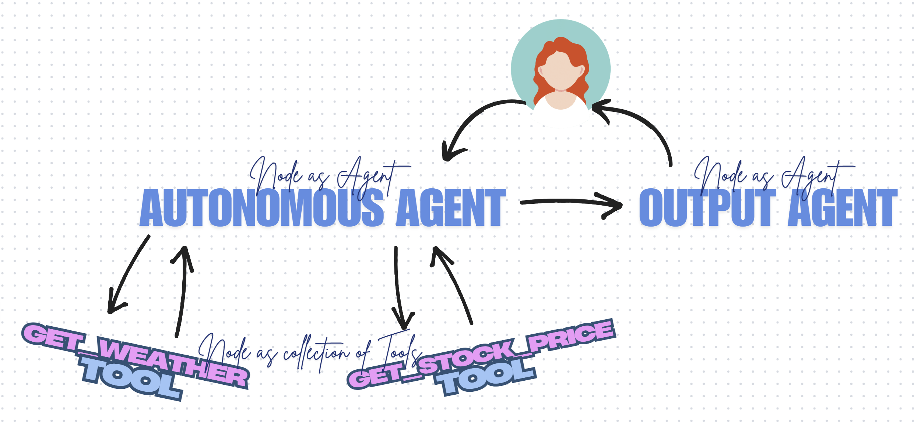

# langgraph_tool_calling
This application helps in understanding how Tool calling works in Custom Agent Graph workflow.



# Prerequisites
* Create vitual environment on your system (for Windows).
Be inside you project root folder (langgraph_tool_calling)
    ```
    python -m venv venv
    cd venv
    cd scripts
    activate
    cd..
    cd..

    pip install -r requirements.txt
    ```
* Inside project rool folder (langgraph_tool_calling), create config.yaml and update your OPENAI_API_KEY.
    ```
    OPENAI_API_KEY: "<<ADD YOUR OPEN_AI_KEY>>"
    LANGCHAIN_TRACING_V2 : "true"
    LANGCHAIN_ENDPOINT : "https://api.smith.langchain.com"
    LANGCHAIN_API_KEY : "<<ADD YOUR LANGSMITH API KEY>>"
    LANGCHAIN_PROJECT : "<<ADD YOU LANGSMITH FOLDER>>"

    ```
<br>
<br>